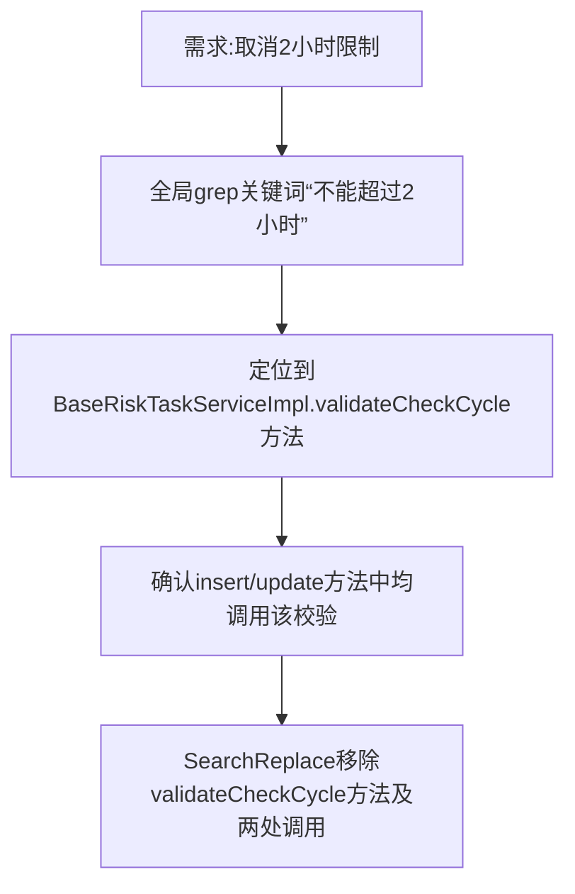

## 任务描述
取消风险排查任务中“小时级巡检周期不能超过2小时”的校验限制。

## 执行过程

```mermaid
graph TD
    A[需求:取消2小时限制] --> B[全局grep关键词“不能超过2小时”]
    B --> C[定位到BaseRiskTaskServiceImpl.validateCheckCycle方法]
    C --> D[确认insert/update方法中均调用该校验]
    D --> E[SearchReplace移除validateCheckCycle方法及两处调用]
```

## 任务总结
成功解除小时级巡检周期限制：删除 validateCheckCycle 方法，并同步移除 insertBaseRiskTask 和 updateBaseRiskTask 中的调用，使小时级周期可自由配置。
