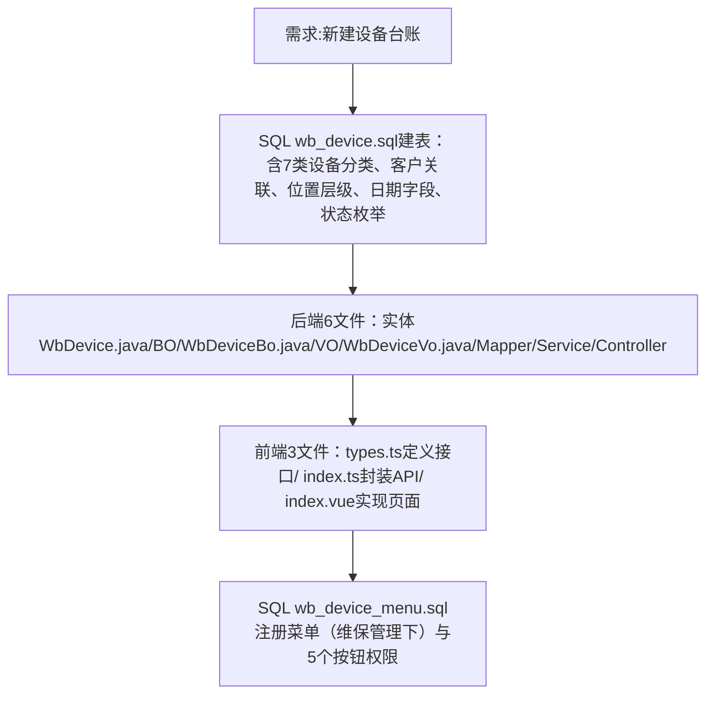

## 任务描述
新建消防设备台账模块，支持设备编号/名称/分类(7种)/型号/客户/位置/楼栋楼层/厂家/安装/到期/维保日期/状态等字段的CRUD及导出。

## 执行过程

```mermaid
graph TD
    A[需求:新建设备台账] --> B[SQL wb_device.sql建表：含7类设备分类、客户关联、位置层级、日期字段、状态枚举]
    B --> C[后端6文件：实体WbDevice.java/BO/WbDeviceBo.java/VO/WbDeviceVo.java/Mapper/Service/Controller]
    C --> D[前端3文件：types.ts定义接口/ index.ts封装API/ index.vue实现页面]
    D --> E[SQL wb_device_menu.sql注册菜单（维保管理下）与5个按钮权限]
```

## 任务总结
设备台账模块完整交付：SQL建表含完整业务字段与索引；后端提供分页查询/模糊搜索/精确筛选能力；前端页面支持列表/筛选/新增/修改/导出；菜单权限与系统统一集成。
