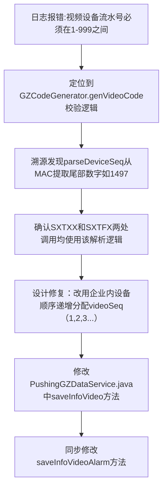

## 任务描述
修复GZ视频报警推送中因MAC地址解析设备流水号超限（>999）导致的IllegalArgumentException异常。

## 执行过程

```mermaid
graph TD
    A[日志报错:视频设备流水号必须在1-999之间] --> B[定位到GZCodeGenerator.genVideoCode校验逻辑]
    B --> C[溯源发现parseDeviceSeq从MAC提取尾部数字如1497]
    C --> D[确认SXTXX和SXTFX两处调用均使用该解析逻辑]
    D --> E[设计修复：改用企业内设备顺序递增分配videoSeq（1,2,3...）]
    E --> F[修改PushingGZDataService.java中saveInfoVideo方法]
    F --> G[同步修改saveInfoVideoAlarm方法]
```

## 任务总结
成功修复视频设备编号生成逻辑：将原依赖MAC地址尾部数字解析的方式，替换为按设备列表顺序分配1-999内的递增videoSeq，彻底规避超限异常，保障SXTXX和SXTFX两类视频数据推送正常。
