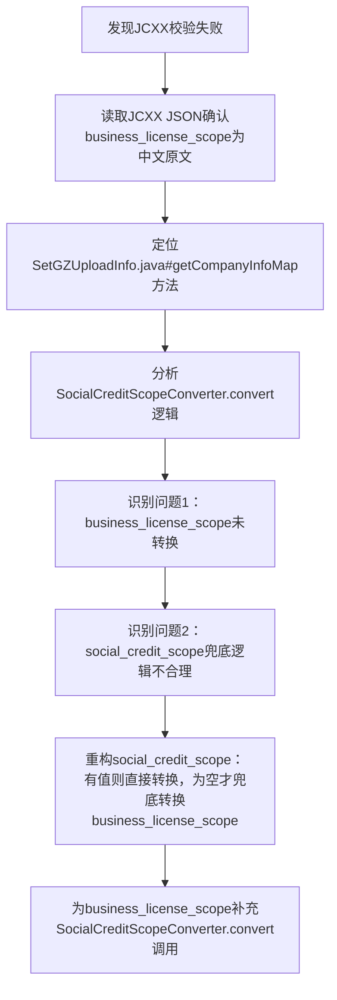

## 任务描述
修复省平台校验失败：【JCXX】营业执照经营范围编码不合法。

## 执行过程

```mermaid
graph TD
    A[发现JCXX校验失败] --> B[读取JCXX JSON确认business_license_scope为中文原文]
    B --> C[定位SetGZUploadInfo.java#getCompanyInfoMap方法]
    C --> D[分析SocialCreditScopeConverter.convert逻辑]
    D --> E[识别问题1：business_license_scope未转换]
    E --> F[识别问题2：social_credit_scope兜底逻辑不合理]
    F --> G[重构social_credit_scope：有值则直接转换，为空才兜底转换business_license_scope]
    G --> H[为business_license_scope补充SocialCreditScopeConverter.convert调用]
```

## 任务总结
成功修复JCXX校验错误：统一将social_credit_scope和business_license_scope字段经SocialCreditScopeConverter.convert()转换为编码格式（如"01,02,03"），避免直接传递中文文本导致省平台拒绝。
