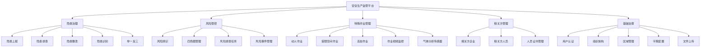

```mermaid
graph TD
    A[安全生产监管平台] --> B[隐患治理]
    A --> C[风险管控]
    A --> D[特殊作业管理]
    A --> E[相关方管理]
    A --> F[基础支撑]
    B --> B1[隐患上报]
    B --> B2[隐患排查]
    B --> B3[隐患整改]
    B --> B4[隐患识别]
    B --> B5[举一反三]
    C --> C1[风险辨识]
    C --> C2[四色图管理]
    C --> C3[风险排查任务]
    C --> C4[风险事件管理]
    D --> D1[动火作业]
    D --> D2[受限空间作业]
    D --> D3[高处作业]
    D --> D4[作业视频监控]
    D --> D5[气体分析传感器]
    E --> E1[相关方企业]
    E --> E2[相关方人员]
    E --> E3[人员证书管理]
    F --> F1[用户认证]
    F --> F2[组织架构]
    F --> F3[区域管理]
    F --> F4[字典配置]
    F --> F5[文件上传]
```
