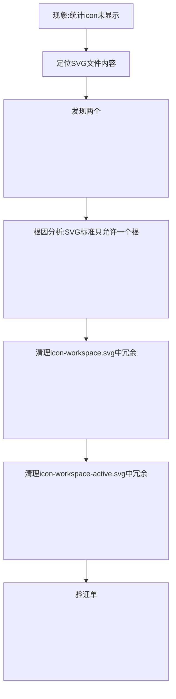

## 任务描述
修复统计图标（workspace icon）未显示问题。

## 执行过程

```mermaid
graph TD
    A[现象:统计icon未显示] --> B[定位SVG文件内容]
    B --> C[发现两个<svg>元素拼接]
    C --> D[根因分析:SVG标准只允许一个根<svg>元素]
    D --> E[清理icon-workspace.svg中冗余<svg>]
    E --> F[清理icon-workspace-active.svg中冗余<svg>]
    F --> G[验证单<svg>结构可正常加载]
```

## 任务总结
SVG 图标渲染失败的典型原因是文件中存在多个 `<svg>` 根元素。修复方式为严格保留唯一 `<svg>` 标签，删除拼接的第二个 `<svg>` 及其子内容。该规则适用于所有通过 `<image>` 或 `background-image` 引用的 SVG 文件。
