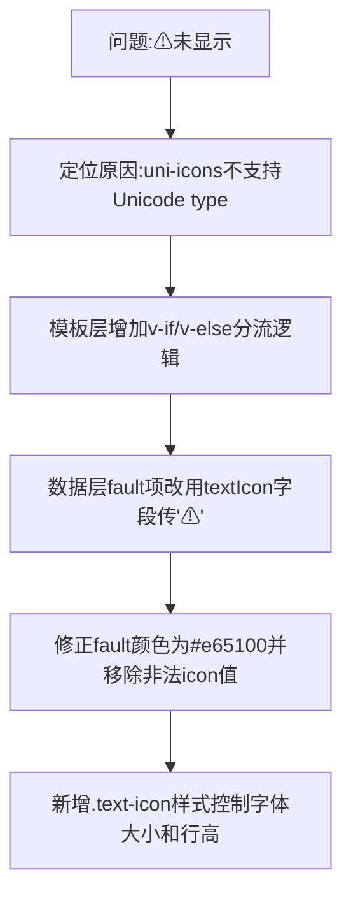

## 任务描述
修复故障项图标显示异常问题，将黄色三角感叹号（⚠）正确渲染为文本图标而非uni-icons图标。

## 执行过程

```mermaid
graph TD
    A[问题:⚠未显示] --> B[定位原因:uni-icons不支持Unicode type]
    B --> C[模板层增加v-if/v-else分流逻辑]
    C --> D[数据层fault项改用textIcon字段传'⚠']
    D --> E[修正fault颜色为#e65100并移除非法icon值]
    E --> F[新增.text-icon样式控制字体大小和行高]
```

## 任务总结
成功实现⚠文本图标渲染：在index.vue中通过textIcon字段+条件渲染+专属CSS样式三者协同，使故障项正确显示黄色三角感叹号，避免了uni-icons对Unicode图标的兼容性问题。
