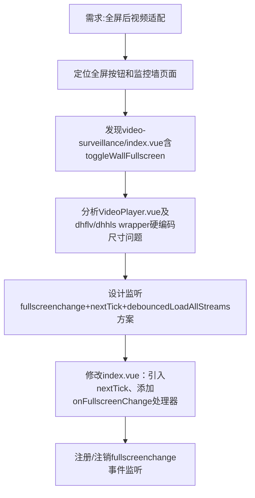

## 任务描述
实现监控墙全屏后视频播放器自动重载并适配新画面尺寸。

## 执行过程

```mermaid
graph TD
    A[需求:全屏后视频适配] --> B[定位全屏按钮和监控墙页面]
    B --> C[发现video-surveillance/index.vue含toggleWallFullscreen]
    C --> D[分析VideoPlayer.vue及dhflv/dhhls wrapper硬编码尺寸问题]
    D --> E[设计监听fullscreenchange+nextTick+debouncedLoadAllStreams方案]
    E --> F[修改index.vue：引入nextTick、添加onFullscreenChange处理器]
    F --> G[注册/注销fullscreenchange事件监听]
```

## 任务总结
成功解决全屏后视频画面不填满问题：在video-surveillance/index.vue中监听fullscreenchange事件，利用nextTick确保DOM尺寸更新后再调用debouncedLoadAllStreams，销毁旧播放器并以新容器尺寸重建所有视频流。
