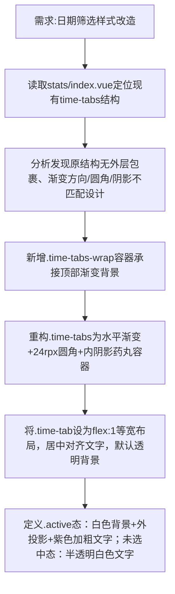

## 任务描述
按UI设计图统一统计页面（stats/index.vue）日期筛选组件的视觉样式，实现紫色渐变药丸容器内四等宽按钮，支持选中/未选中状态区分。

## 执行过程

```mermaid
graph TD
    A[需求:日期筛选样式改造] --> B[读取stats/index.vue定位现有time-tabs结构]
    B --> C[分析发现原结构无外层包裹、渐变方向/圆角/阴影不匹配设计]
    C --> D[新增.time-tabs-wrap容器承接顶部渐变背景]
    D --> E[重构.time-tabs为水平渐变+24rpx圆角+内阴影药丸容器]
    E --> F[将.time-tab设为flex:1等宽布局，居中对齐文字，默认透明背景]
    F --> G[定义.active态：白色背景+外投影+紫色加粗文字；未选中态：半透明白色文字]
```

## 任务总结
成功实现符合设计规范的日期筛选组件：新增外层容器保障视觉连贯性，药丸容器采用90度水平渐变与内阴影增强立体感，按钮等宽自适应且状态反馈精准，适配uni-app多端渲染。
