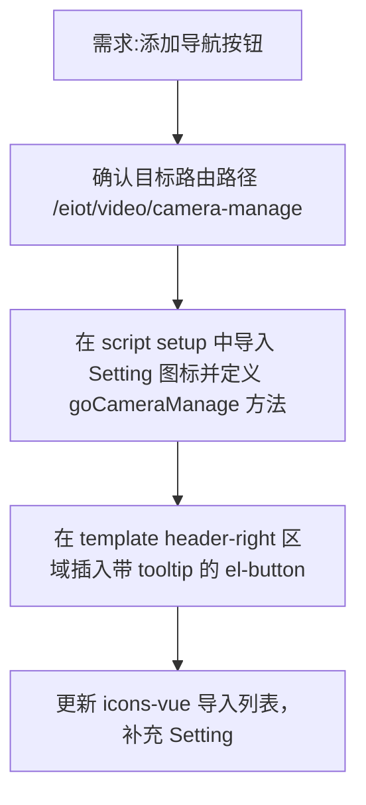

## 任务描述
在 video-surveillance/index.vue 页面右上角添加‘摄像头管理’跳转按钮。

## 执行过程

```mermaid
graph TD
    A[需求:添加导航按钮] --> B[确认目标路由路径 /eiot/video/camera-manage]
    B --> C[在 script setup 中导入 Setting 图标并定义 goCameraManage 方法]
    C --> D[在 template header-right 区域插入带 tooltip 的 el-button]
    D --> E[更新 icons-vue 导入列表，补充 Setting]
```

## 任务总结
成功添加标准化导航按钮：使用 el-tooltip 封装按钮文案，el-icon 嵌套 Setting 图标，点击触发 router.push 跳转；同步更新图标导入列表，确保图标可用。
