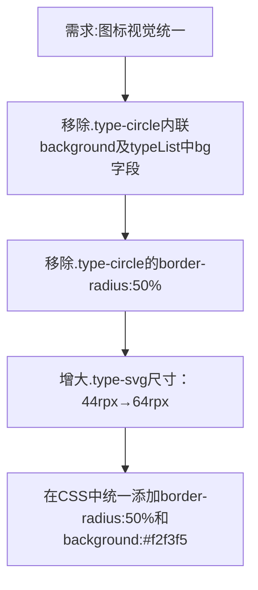

## 任务描述
统一优化首页告警类型图标的视觉表现：移除内联背景色、放大 SVG 图标、统一添加浅灰圆形背景。

## 执行过程

```mermaid
graph TD
    A[需求:图标视觉统一] --> B[移除.type-circle内联background及typeList中bg字段]
    B --> C[移除.type-circle的border-radius:50%]
    C --> D[增大.type-svg尺寸：44rpx→64rpx]
    D --> E[在CSS中统一添加border-radius:50%和background:#f2f3f5]
```

## 任务总结
完成图标视觉重构：消除内联样式冗余，通过 CSS 统一控制圆形背景与圆角，SVG 图标放大至 64rpx，实现简洁、协调、高辨识度的类型展示效果。
